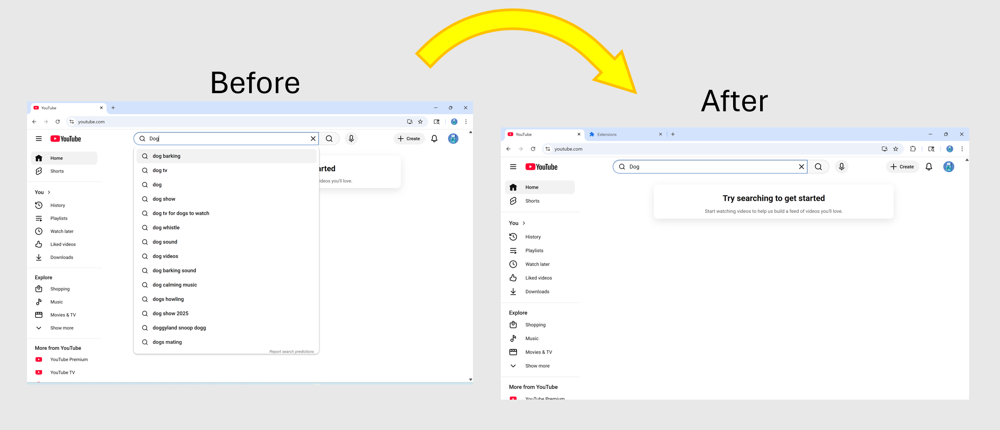

# Youtube Search Search Suggestion Blocker Browser Extension
Youtube has a search suggestion which will suggest you with some similay keywords, if you just want to type your own keyword, you might think it is disturbing to you.

This is a browser extension that can remove the searching Suggestion when you are searching YouTube video in YouTube's search bar

## Installation
1. **Download the extensions**
   - On the top of the repoistiories, click the green **Code** button and then select **Download as ZIP**.
   - After you downloaded the zip files, extract the file on your computer.
   
3. **Go to the extensions setting page.**
   - Open your browser and go to the extensions setting page.
   - For Google Chrome go to ````chrome://extensions```` 
   - For Microsoft Edge go to ````edge://extensions````
4. **Turn on "Developer mode".**
   - There has a switch on the browser and it is called **Developer mode**, enable it to turn on developer mode.
5. **Upload unpacked folder**
   - Click "Load unpacked" and select the folders where you extract the files.
6. **Enable the extensions.**
   - Turn on your extensions on your browser's extensions setting page
7. **Done**
   - Go to the search bar of the browser and you will see the extensions.
  
- **Igore the popup warning**
  - For sercurity reason, browser will remind you with a popup message that said you turned on the developer mode because you installed a third party extensions, if you make sure the extensions is from trused sources or you checked the code that it is safe to use, then you can igore the message.

# Screenshot
